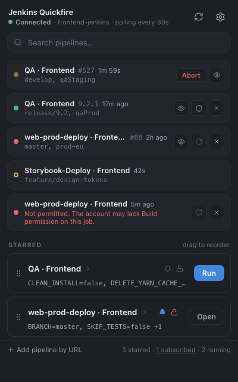
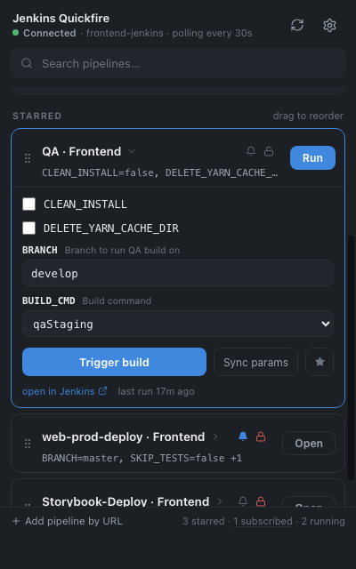
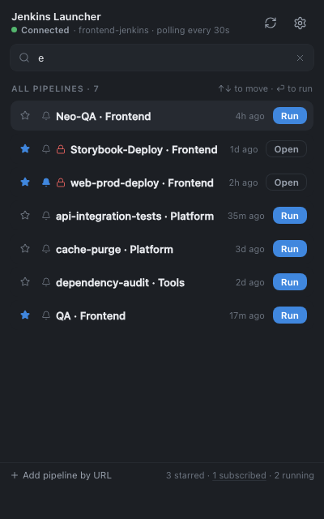
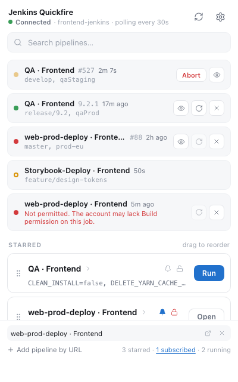
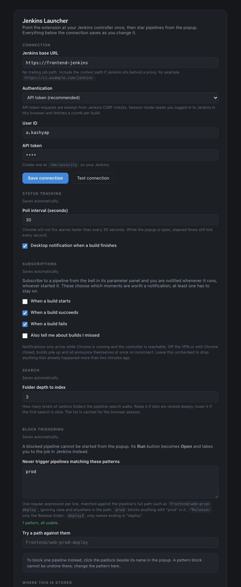

# Jenkins Launcher

A Chrome extension for starting Jenkins builds without opening Jenkins.

Search the whole controller, keep the pipelines you use in a list, fill in the parameters and
trigger — from a popup that opens instantly, instead of a web UI that takes its time. Builds
you start are tracked to completion; pipelines you subscribe to tell you when anyone else
starts one.



Manifest V3, plain HTML, CSS and JavaScript. No bundler, no build step, no dependencies.

---

## Installing

1. `chrome://extensions` → enable **Developer mode** → **Load unpacked** → pick this folder.
2. Open the extension, then the gear icon.
3. Enter your Jenkins base URL, your user ID and an API token from `/me/security` on your
   Jenkins. Press **Save connection** and approve the host permission Chrome asks for.
4. Press **Test connection**. It should name the account builds will run as.

The host permission is requested at runtime for the origin you enter, rather than declared
up front, so the extension has no access to any site until you point it at one.

---

## The popup

### Activity

Everything you triggered from the extension, newest first, up to 40 entries. Each card is two
lines: name, build number and time on the first, the values the build ran with on the second.

The coloured dot carries the status, so the card does not spend a line spelling it out. A
ring rather than a filled dot means queued — the one state a colour cannot express — and the
dot's tooltip names the state either way, including the queue reason Jenkins gives.

Where the build number sits, a version appears instead once the pipeline sets one. Every poll
re-reads the build's `displayName`, which is what `currentBuild.displayName = "9.2.1"` writes
and what Jenkins' own UI shows in place of `#N`. The number stays in the tooltip.

Parameters are shown as values only, not `KEY=value`: a branch name or a build command
identifies itself, and the key doubles the length of a line that has to fit in 400px. The keys
are in the tooltip. Booleans are left out, since a row of `false` says nothing about what the
build was.

Running builds tick every second and can be aborted. Finished ones offer three buttons: an eye
that opens the build in Jenkins, a circular arrow that runs it again, and a cross that
dismisses it.

**Re-running** reads the values off the run record rather than the pipeline's saved ones, so
it reproduces what that build actually used even if the saved values have been edited since.
It does not write them back either: replaying an old build should not quietly become the new
default.

### Starred pipelines



Click a name to expand its parameters, fetched from Jenkins and rendered by type — text
fields, choice dropdowns, checkboxes, password fields. Values are remembered per pipeline, so
the next build starts from what you used last. **Run** triggers with those values directly;
**Trigger build** in the panel does the same after you have edited them. **Sync params**
re-reads the definitions when the Jenkinsfile changes.

Drag the grip to reorder. **Add pipeline by URL** at the bottom takes any Jenkins URL
containing the job — build page, console, job page — and trims it to the job path.

Panels slide open and shut: the wrapper is a grid whose single row animates between
`minmax(0, 0fr)` and `minmax(0, 1fr)`, so no height is measured and a two-field pipeline and a
ten-field one take the same 190ms. Reduced-motion preferences cut that to nothing.

### Search



Type anything and the popup switches to search across every job on the controller. The index
comes from one recursive `/api/json?tree=jobs[...]` call, cached in `chrome.storage.session`,
so typing is instant after the first load.

Results run without starring. Every row has a Run button that triggers with saved values, or
the job's own Jenkins defaults the first time. Clicking the row expands the same parameter
form. Arrow keys move, Enter runs the highlighted result, Shift+Enter opens its parameters,
Escape clears. A successful trigger drops back to browse, because that is where the new run
is visible.

Starring is a separate act — the star in the row, or in the expanded panel. Running a pipeline
from search never stars it.

### Names

Pipelines read `QA · Frontend`: the job leads, since that is what you are scanning for, and
the immediate parent folder trails as the disambiguator between the several folders that each
contain a job called QA. The full path is in the tooltip, and both lines ellipsize from the
right, so a long path loses the folder rather than the job.

---

## Blocking a pipeline

The padlock beside a pipeline's name stops it being started by accident. A blocked pipeline
appears exactly where it did before, but its **Run** and **Trigger build** buttons become
**Open** and take you to the job in Jenkins. Clicking the name still expands the parameters:
withholding the build should not make the values unreadable.

Two independent sources, either of which blocks:

- **The padlock**, for one pipeline at a time. Stored in `chrome.storage.sync` under
  `blocked`. Blocks survive unstarring, since unstarring is tidying and should not disarm a
  guard.
- **Patterns in settings**, for pipelines you have not starred or that do not exist yet.
  Regular expressions matched case-insensitively and unanchored against the full path.

A pattern block cannot be lifted from the popup — its padlock shows but does not open —
because a deny-list you can click away on the card it is guarding is not a deny-list.

The rule lives in `lib/guard.js`, with no DOM or chrome dependency, so the service worker
enforces exactly what the popup draws. The popup swapping the button is an affordance;
`trigger()` in `background.js` checking again is the guard, and it catches the replay button,
the search Enter key, a stale popup and anything else that reaches the worker.

The padlock only appears on a search row that is already blocked, so blocking something from
search before starring it means writing a pattern.

---

## Subscribing



The bell beside the padlock watches a pipeline whoever starts it — someone else's deploy, a
webhook, a nightly. The run list cannot do this; it only knows about builds this extension
asked for. Filled means subscribed, and the bell is always available on search rows, since
subscribing has no other route.

The footer counts them next to the starred count, and that count is a button. A subscription
is otherwise invisible unless you happen to be looking at the pipeline carrying it, so the
list is the only place the whole set can be seen; each row opens the job or drops the
subscription.

Each poll asks every subscription for its last build and compares against a watermark: a
higher number is a start, a verdict on the number we were watching is a finish. `lib/watch.js`
decides, and three cases it gets right that a first attempt would not:

- The first sight of a pipeline is recorded silently, or subscribing would announce whatever
  happened to run last.
- Jenkins reports `building: false` with `result: null` for a moment at the end of a build, so
  a build counts as over only once it has a verdict. Otherwise every finish would announce a
  failure that never happened.
- A build that starts and finishes inside one poll reports the finish only, and builds skipped
  entirely between polls are not reported at all.

Builds the extension triggered itself still notify from the run list, exactly as before
subscriptions existed. The subscription poll skips any build already in the run list, matched
on job and build number, so subscribing to a pipeline you also trigger does not double up.
Two consequences: a build you start yourself never produces a *started* notification even with
that kind switched on, because the run list does not send one and the subscription is
suppressed; and if run tracking loses a build — the three-hour give-up, or the run list
rolling past 40 entries — the subscription announces it, which is the right way round.

### Missed builds

Notifications only arrive while Chrome is running and the controller is reachable. Off the
VPN or with Chrome closed, builds pile up and all announce themselves at once on reconnect.
Anything that happened more than two minutes ago is dropped unless **Also tell me about builds
I missed** says otherwise.

---

## Settings



The connection has a Save button because saving it also asks Chrome for permission to reach
the controller, and Chrome only grants that from a click. Everything else is a preference and
writes as you change it, with the confirmation next to the control rather than at the top of
the page.

That split exists because a single Save button under the connection fields made a setting
three sections below it look like it had saved itself. It had not, and nothing said so.

Two smaller guarantees. A refused write is reported rather than swallowed: `chrome.storage
.sync` has its own quotas, and a rejection used to end up in an unhandled promise while the
page said Saved. And a deny pattern that will not compile is not written at all, since storing
a rule the guard skips reads as blocking being broken rather than that line being wrong.

**Test connection** runs two checks, because they can disagree and that difference is the
point. The first uses the values in the form. The second asks the service worker, which is
what actually runs a build: stored config, its own copy of the client. A green form check with
a red worker check means the settings were never saved, or Chrome is running a stale
background script.

---

## Connection state

The header dot reports the controller, re-checked when the popup opens.

| State | Meaning |
| --- | --- |
| **Connected** | `/me/api/json` answered and named a real account. |
| **Offline** | The request never reached Jenkins. Usually the VPN. |
| **Unauthorized** | Jenkins answered but rejected the credentials, or answered as anonymous. |

Offline is a distinct state rather than an error, because it is the normal condition when you
are away from the VPN and nothing is wrong with the setup. The poller skips network failures
rather than marking a tracked build as failed, so a dropped connection does not lose a build
that is still running.

---

## Authentication

**API token** (recommended) sends HTTP Basic on every request. Jenkins exempts token requests
from CSRF, so no crumb is needed.

**Browser session** reuses the cookies of a Jenkins tab you are already logged in to, and
fetches a crumb from `/crumbIssuer/api/json` before each build. Useful if your Jenkins is
behind SSO that will not issue tokens.

Missing credentials fail loudly rather than sending an unauthenticated request. A 401 from
Jenkins reads as "your token is wrong" when the real problem is that no token was ever saved.

---

## Where things are stored

| What | Area | Why |
| --- | --- | --- |
| `config` — base URL, user ID, poll interval, notification kinds, search depth, deny patterns | `sync` | follows your Chrome profile |
| `starred` — pipelines and their parameter definitions | `sync` | follows your Chrome profile |
| `paramValues` — the values you last used | `sync` | follows your Chrome profile |
| `blocked` — pipeline ids blocked by hand | `sync` | follows your Chrome profile |
| `subscriptions` — pipelines being watched | `sync` | follows your Chrome profile |
| `token` — the API token | **`local`** | deliberately not synced |
| `runs` — tracked builds, newest 40 | `local` | machine-specific and noisy |
| `watch` — last build seen per subscription | `local` | rewritten per build; sync caps writes per hour |

The token is the one deliberate deviation. `chrome.storage.sync` uploads to Google and
propagates to every Chrome profile signed into the same account, which is the wrong place for
a Jenkins credential. Password build parameters are sent to Jenkins but never written to
storage at all, which is also why a re-run leaves them out and Jenkins falls back to its own
defaults.

The job index for search lives in `chrome.storage.session` and is dropped when the browser
closes.

---

## How a build is tracked

1. `POST buildWithParameters` (or `/build` for a pipeline with no parameters). Jenkins replies
   `201` with a `Location` header pointing at a queue item. Extension contexts with host
   permissions are exempt from CORS, so that header is readable — a page on the open web could
   not read it.
2. The queue item is polled until it names an executable, which gives the build number and URL.
3. The build is polled until `building` goes false, then the result is recorded and announced.
4. A build still being chased after three hours is given up on rather than polled forever.

Polling runs on a `chrome.alarms` alarm. Thirty seconds is Chrome's floor and the default;
while the popup is open, elapsed times still tick every second. The toolbar badge shows how
many builds are in flight, in red if any recent one did not succeed.

---

## Reloading during development

Chrome does not always replace a running service worker when you press Reload on an unpacked
extension, so the popup can be new code while the worker is old. Every symptom after that is a
red herring — a green Test connection next to a 401 on trigger, most memorably.

Both sides report the stamp in `lib/build.js`. A mismatch is exactly this situation, and the
popup shows a banner offering `chrome.runtime.reload()`. **Bump `BUILD` whenever you change
the service worker or anything it imports.**

---

## Working on it

`dev/preview.html` opens the popup in a normal browser tab, with `dev/mock-chrome.js` stubbing
the extension APIs and a fake Jenkins. No extension reload, no VPN.

```
python3 -m http.server 8731
open http://localhost:8731/dev/preview.html
```

Resize to 400×600 to match the real popup. `dev/options-preview.html` does the same for the
settings page; rather than copying its markup it lifts the real `options.html`'s style and
sheet out of the file, so it cannot drift.

Harness storage persists to `sessionStorage` and seeds only a cold start, so a save that
stores nothing does not look like one that worked — reseeding on every load is why an earlier
version could not have caught a persistence bug. `?fresh` resets, `?empty` shows the
fresh-profile state, `?stale` reproduces the stale-worker banner, `?full` makes every sync
write fail the way a real one does at its quota. Serve with no-cache headers if you are
iterating; a cached `options.html` looks exactly like a broken change.

`./dev/shoot.sh` retakes the screenshots in `docs/` from the harness, so they show the same
fixture every time and never a real controller's job names. Nothing in `dev/` or `docs/`
ships.

### Tests

```
for t in test/*.test.mjs; do node "$t"; done
```

Plain `node`, no framework. They cover the parts that are pure functions and easy to get
subtly wrong: URL normalisation across job, build, console, view and reverse-proxy context
paths; credential handling; display names and build labels; the run record's shape, using the
same factory the worker uses so the harness cannot disagree with it; the blocking rule; and
the subscription state machine.

### Layout

```
manifest.json      MV3 manifest
background.js      service worker: triggering, polling, notifications
popup.html/js/css  the popup
options.html/js    settings
lib/jenkins.js     REST client
lib/store.js       storage layer
lib/guard.js       whether a pipeline may be triggered
lib/watch.js       what to say about a subscribed pipeline
lib/format.js      display helpers, shared with the worker
lib/icons.js       inlined Lucide paths
lib/dom.js         element helpers
lib/build.js       the staleness stamp
```

Icons are inlined Lucide path data, so the extension ships no icon font and makes no network
request for chrome. The design tokens at the top of `popup.css` came verbatim from the
original design handoff, which is no longer in the tree; `popup.css` is the record of them
now.

---

## Known gaps

- File parameters are unsupported; `buildWithParameters` needs multipart for those.
- Credentials and Run parameter types render as plain text inputs.
- Multibranch jobs must be starred at the branch level, since the top level is a folder.
- Search indexes to `searchDepth` folder levels, three by default. Deeper jobs are invisible to
  search but can still be added by URL.
- Re-running a finished build leaves out its password parameters, because they are stripped
  before a run is recorded.
- Subscription notifications need Chrome running and the controller reachable. There is no
  push from Jenkins, only the thirty-second alarm.
